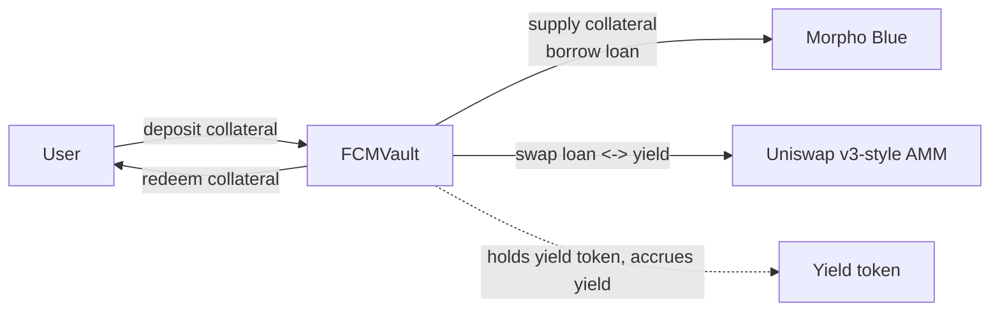

# FCM core

FCM is an automated carry trade protocol: Vaults are deployed which automatically borrow against deposited collateral to invest in a yield-bearing asset.
This allows earning a higher yield on assets which typically do not have access to high yield sources, such as BTC.

FCM continuously `rebalances` the position to hold as high an LTV as safely possible, maximizing exposure to the yield-bearing asset while staying clear of liquidation, and periodically `harvests` the accrued yield back into collateral to keep 100% asset exposure.

## Architecture

Each `FCMVault` is an ERC-4626 vault that runs a single, immutable three-leg carry trade:

1. **Collateral leg** — the ERC-4626 asset, supplied to [Morpho Blue](https://github.com/morpho-org/morpho-blue) to create borrowing capacity.
2. **Debt leg** — a loan token borrowed against that collateral.
3. **Yield leg** — the loan token swapped into a yield-bearing token (the carry source) on a Uniswap-v3-style AMM.

A deposit posts collateral, borrows against it, and swaps the proceeds into the yield token, all in one transaction; a redeem reverses this, selling the yield leg, repaying debt, and returning collateral, also in one transaction. Neither takes a slippage-limit argument (per the ERC-4626 spec), so both should be called through a router that adds its own minimum-output check — e.g. the vendored [Yearn ERC4626 Router](https://github.com/yearn/Yearn-ERC4626-Router) — rather than directly.

A permissionless `rebalance()` keeps the position's health factor inside a target band - delevering (selling yield for loan token, repaying debt) when the collateral price falls and levering back up when it rises - so the vault never sells collateral to manage risk.
A permissionless `harvest()` periodically converts surplus yield back into collateral, so depositors keep full collateral exposure while compounding the yield spread directly into share price. Both entry points are permissionless by design.

Full design rationale - in [Architecture](./docs/architecture.md).

## Security

### Risks

FCM runs a levered position, which requires constantly borrowing, repaying, and swapping on the vault's behalf. The costs and risks of those actions are inherent to the strategy itself, not implementation defects. See [Risk Disclosures](./docs/risk-disclosures.md) for the full breakdown.

### Dependencies

The vault composes a levered position out of four external systems it does not control: Morpho Blue (the lending market), a Uniswap-v3-style AMM (the swap venue), the yield token's own inner vault, and the Morpho market's price oracle. Each is a separate trust boundary — see [`security-surface.md`](./docs/security-surface.md) for the full per-dependency, per-function failure-mode breakdown.

### Factory

`FCMVaultFactory` deploys vaults permissionlessly, with arbitrary tokens, swap pool, morpho, oracles, etc. **A vault existing doesn't make it safe.** See [`architecture.md`](./docs/architecture.md#deployment-trust-model--constructor-validation) for what the constructor does and doesn't validate.
