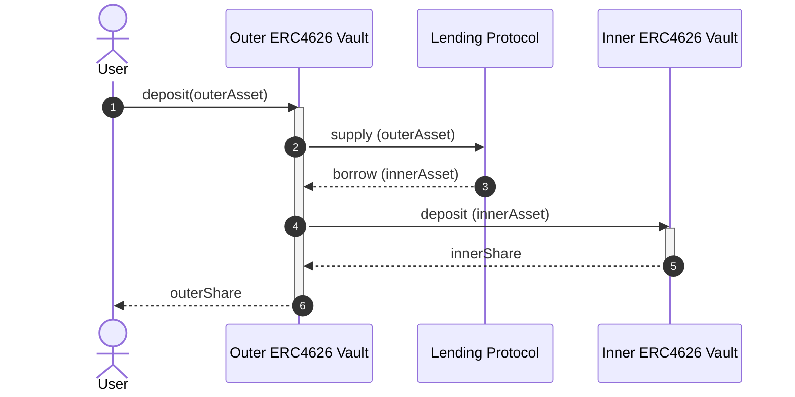

# FCM Architecture

This repo implements an [ERC4626](https://eips.ethereum.org/EIPS/eip-4626)-compliant vault which implements a levered investment with automated rebalancing.

## Terminology
- **Asset** - ERC4626 term meaning "the unit of account of this vault". Deposits, withdrawals, and NAV for a vault are denominated in the vault's asset. The asset must be an ERC20 token.
  - **InnerAsset/OuterAsset** - The asset of the inner vault or outer vault, respective (see below)
- **Share** - ERC4626 term meaning "a portion of the total assets in this vault". Shares are fungible and are represented as ERC20 tokens. Vault users deposit assets and receive shares.
  - **InnerShare/OuterShare** - The share of the inner vault or outer vault, respective (see below)
- **Outer Vault** - The ERC4626 vault implemented in this repository, which borrows against deposits to invest in an inner vault.
- **Inner Vault** - The ERC4626 vault which the outer vault invests borrowing proceeds in.

## Dependencies
### Lending Protocol
[Morpho Blue](https://github.com/morpho-org/morpho-blue)

### Automated Market Maker
[FlowSwap (Uniswap v3)](https://flowswap.io/)

### Inner Vault
[Morpho Vault v2](https://docs.morpho.org/build/earn/concepts/vault-mechanics)

NOTE: Morpho Vault v2 has [unconventional behaviour on some ERC4626 view functions](https://github.com/morpho-org/vault-v2#erc-4626-compliance):
> The vault has a non-conventional behaviour on max functions (maxDeposit, maxMint, maxWithdraw, maxRedeem): they always return zero.

**Liquidity:** Morpho Vault v2 does not guarantee that withdrawals can be satisfied, depending on liquidity conditions. However, it provides a [`forceDeallocate`](https://docs.morpho.org/get-started/resources/contracts/morpho-vaults-v2/#forcedeallocate) method which can be used in conjunction with a flash loan to perform a withdrawal regardless of liquidity. This path has a configurable penalty, which is [set to zero](https://dapperlabs.slack.com/archives/C0AT1TSDFAL/p1779231421973099) in our specific Inner Vault instance.

**NAV Reporting:** Share price (derived from [`totalAssets`](https://docs.morpho.org/get-started/resources/contracts/morpho-vaults-v2/#totalassets)) is updated lazily on each write path. Read paths use [`accrueInterestView`](https://github.com/morpho-org/vault-v2/blob/main/src/VaultV2.sol#L658-L664), which returns an up-to-date share price.

## Deposit Flow

In Step 2/3 above:
- We always supply all deposited collateral, regardless of LTV
- We choose the amount of debt to borrow based on LTV after supply

## Withdrawal Flow (TODO)
- [Schlagonia always withdraws from inner vault, does not use flash loans](https://github.com/Schlagonia/lender-borrower/blob/morpho/src/BaseLenderBorrower.sol#L660-L666)
- Patrick's PoC uses flash loans

## Rebalancing
See **TODO LINK TO REBALANCING SPEC**

## Security
### Donation/Inflation Attack
See [explanation from OpenZeppelin](https://docs.openzeppelin.com/contracts/5.x/erc4626#security-concern-inflation-attack).
### ...

## References / Prior Art

- [Patrick's Vault PoC](https://github.com/holyfuchs/fcm-sol-poc)
- [Schlagonia Morpho Lender Vault](https://github.com/Schlagonia/lender-borrower/blob/morpho/src/MorphoBlueLenderBorrower.sol)
