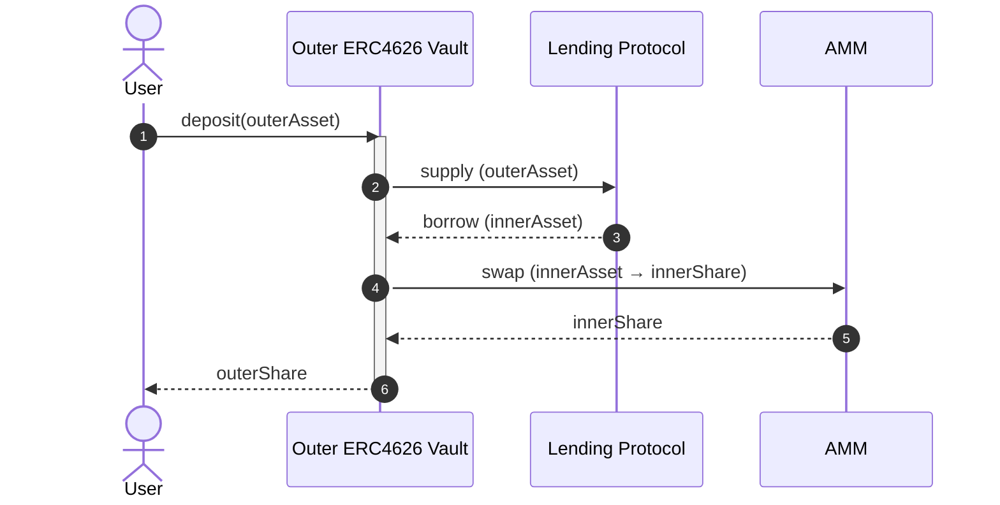
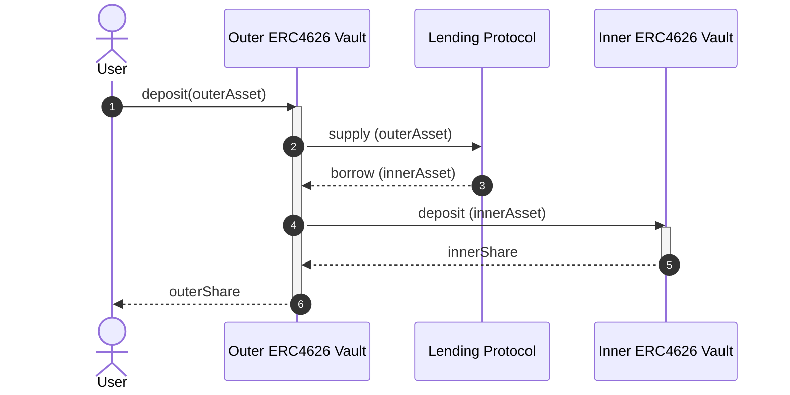
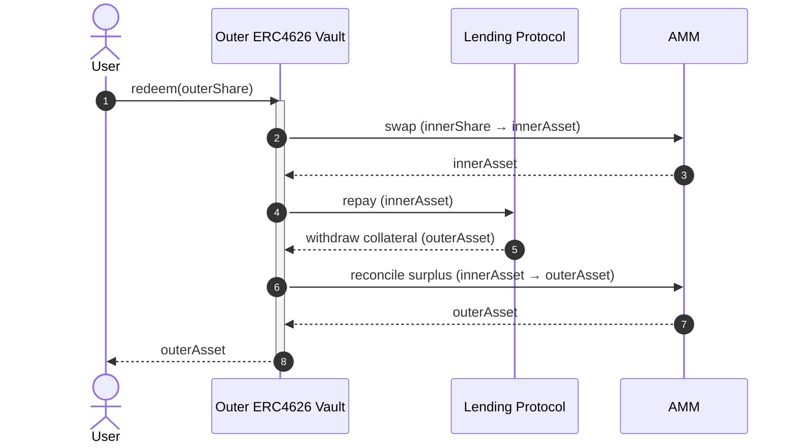
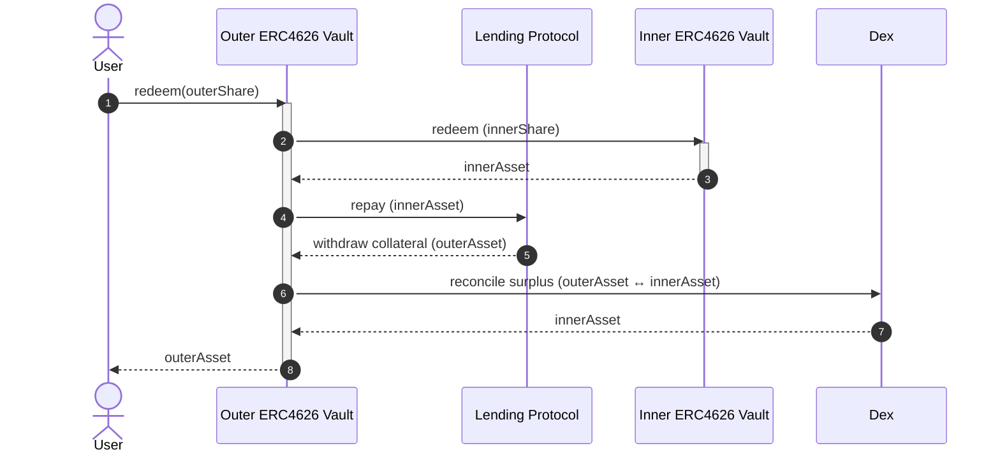
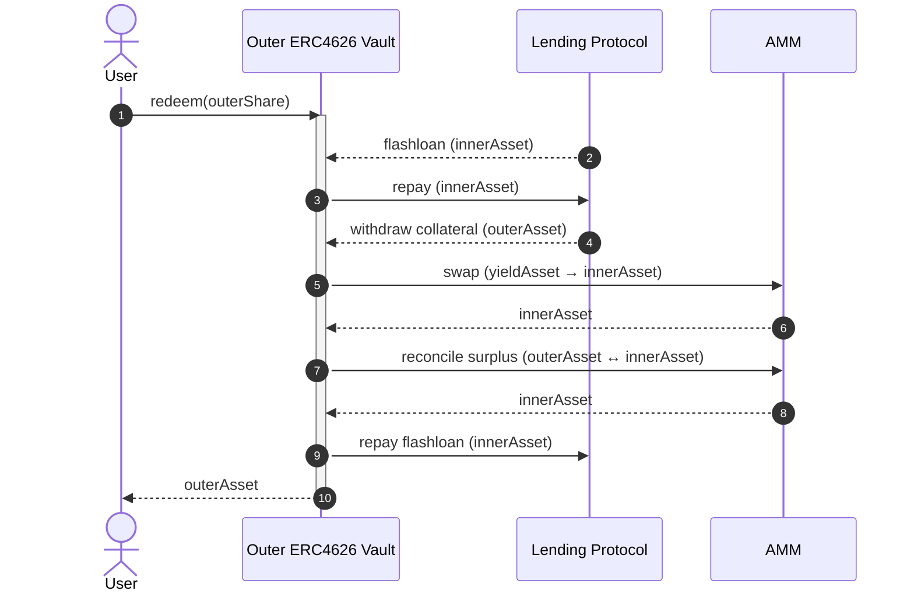

# FCM Architecture

This repo implements an [ERC4626](https://eips.ethereum.org/EIPS/eip-4626)-compliant vault which implements a levered investment with automated rebalancing.

## Terminology
- **Asset** - ERC4626 term meaning "the unit of account of this vault". Deposits, withdrawals, and NAV for a vault are denominated in the vault's asset. The asset must be an ERC20 token.
  - **InnerAsset/OuterAsset** - The asset of the inner vault or outer vault, respective (see below)
- **Share** - ERC4626 term meaning "a portion of the total assets in this vault". Shares are fungible and are represented as ERC20 tokens. Vault users deposit assets and receive shares.
  - **InnerShare/OuterShare** - The share of the inner vault or outer vault, respective (see below)
- **Outer Vault** - The ERC4626 vault implemented in this repository, which borrows against deposits to invest in an inner vault.
- **Inner Vault** - The ERC4626 vault which the outer vault invests borrowing proceeds in.

## Dependencies
### Lending Protocol
[Morpho Blue](https://github.com/morpho-org/morpho-blue)

### Automated Market Maker (AMM)
[FlowSwap (Uniswap v3)](https://flowswap.io/)

### Inner Vault
In general, the inner vault may be any ERC4626-compliant vault. As an example, Jon's FUSDEV vault uses [Morpho Vault v2](https://docs.morpho.org/build/earn/concepts/vault-mechanics)

**Liquidity:** We must assume that the inner vault MAY be unable to satisfy any withdrawal requests, at any time (eg. is illiquid). To address this in a general way, we primarily use DEX swaps to acquire/dispose of InnerShares. We then rely on the DEX to provide sufficient liquidity for the shares. 

**NAV Reporting:** We must assume that the NAV (share price) reported by the vault may be out of date on the order of days.

## Deposit Flow
### AMM-Mediated Deposit
We swap debt tokens (InnerAsset) to InnerShares via an AMM. Our ability to satisfy deposits is dependent on available liquidity in the AMM pool. 

### Direct Deposit
We deposit debt tokens (InnerAsset) to InnerShares via the inner vault's `deposit` function. Our ability to satisfy deposits is dependent on the vault's deposit capacity ([`maxDeposit`](https://ethereum.org/developers/docs/standards/tokens/erc-4626/#maxdeposit))

In Step 2/3 above:
- We always supply all deposited collateral, regardless of LTV
- We choose the amount of debt to borrow based on LTV after supply

## Withdrawal Flow 

### AMM-Mediated Withdrawal

#### Pros
  - Simplest control flow — no flashloan callback, no inner-vault dependency.
  - Works with any yield token that has a liquid DEX pool (no 4626 needed).
  - Atomic — yield is always sellable in-block.

#### Cons
  - Requires repaying debt before withdrawing collateral → reverts if the yield→debt swap underdelivers and the intermediate HF would dip below 1.
  - Pays DEX fees + slippage on the full yield slice every redeem.
  - Pool liquidity risk: thin yield/debt pool degrades or blocks large redeems.
  - Realizes market price, not NAV — large slices suffer price impact. 

### Direct Withdrawal

#### Pros
  - Redeems yield at NAV — no LP fee, no slippage on the yield leg.
  - Independent of DEX liquidity for the yield asset.
  - Simple flow when the inner vault is liquid.

#### Cons
  - Requires the inner vault to honor synchronous redeems; queued/cooldown/idle-capped vaults break the unwind.
  - All-or-nothing on inner liquidity — partial fills can revert mid-tx.

### Flash Loan Path

#### Pros
  - Deterministic unwind at any HF — debt is cleared before collateral moves, so HF
  only improves mid-tx.
  - Clean pro-rata accounting: redeeming user bears exactly their own yield loss;
  remaining LPs untouched.

 #### Cons
  - Most complex: callback-based reentry, encoded calldata, extra Morpho roundtrip.
  - Pays flashloan fee where applicable (0 on Morpho Blue, nonzero elsewhere).
  - Larger attack surface — callback must validate msg.sender and decode data correctly.
  - Still depends on the DEX for the yield sale and reconcile legs (inherits AMM-path's liquidity/slippage risks for those swaps).

## Rebalancing
See **TODO LINK TO REBALANCING SPEC**

## Security
### Donation/Inflation Attack
See [explanation from OpenZeppelin](https://docs.openzeppelin.com/contracts/5.x/erc4626#security-concern-inflation-attack).

Our implementation is safe from this attack because **TODO link to code**.

### ...

## References / Prior Art

- [Patrick's Vault PoC](https://github.com/holyfuchs/fcm-sol-poc)
- [Schlagonia Morpho Lender Vault](https://github.com/Schlagonia/lender-borrower/blob/morpho/src/MorphoBlueLenderBorrower.sol)
