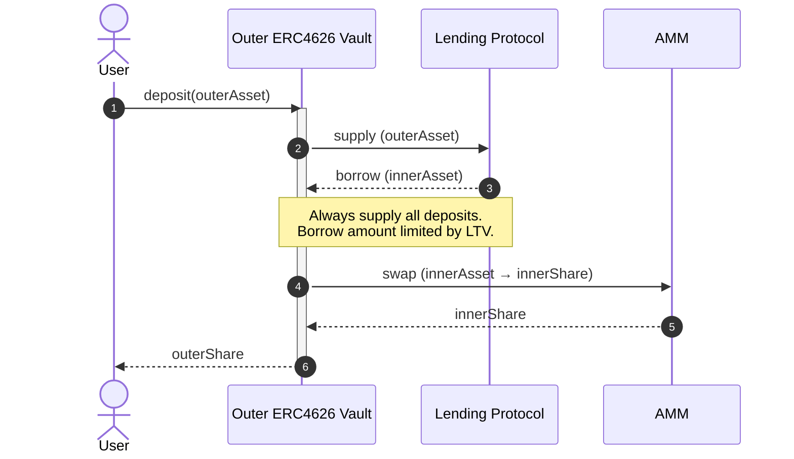
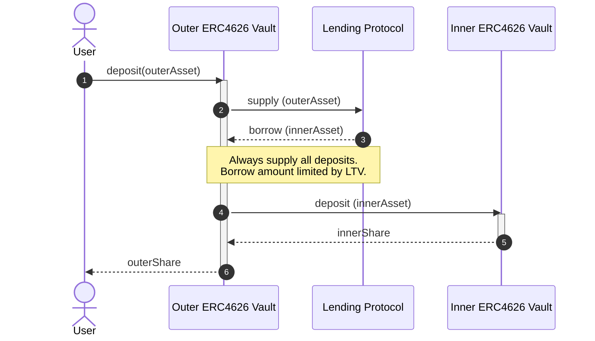
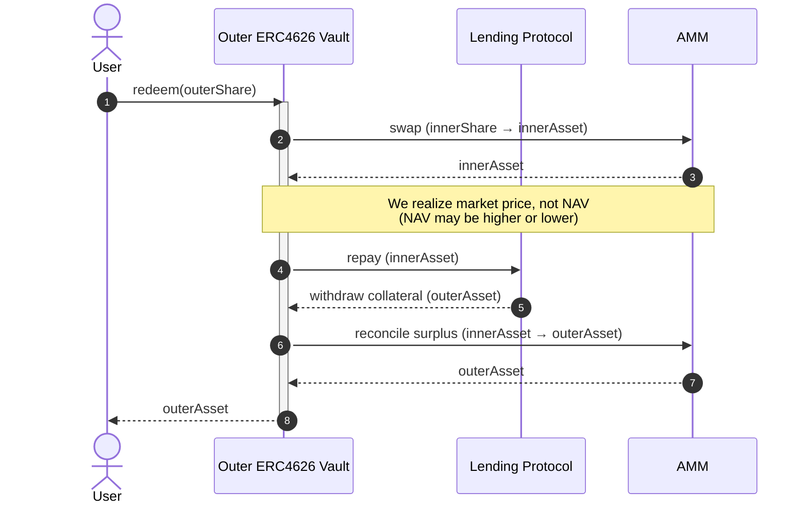
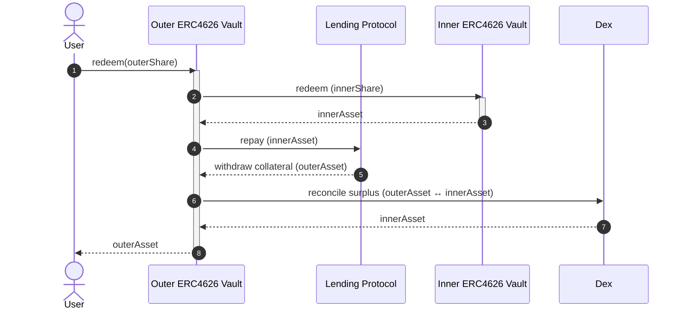
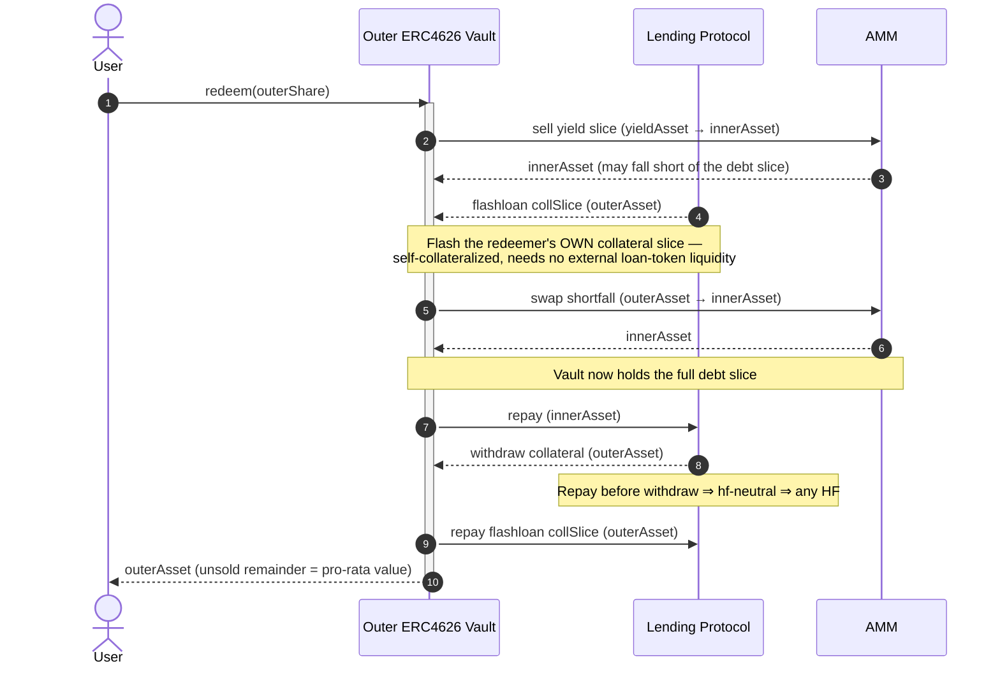
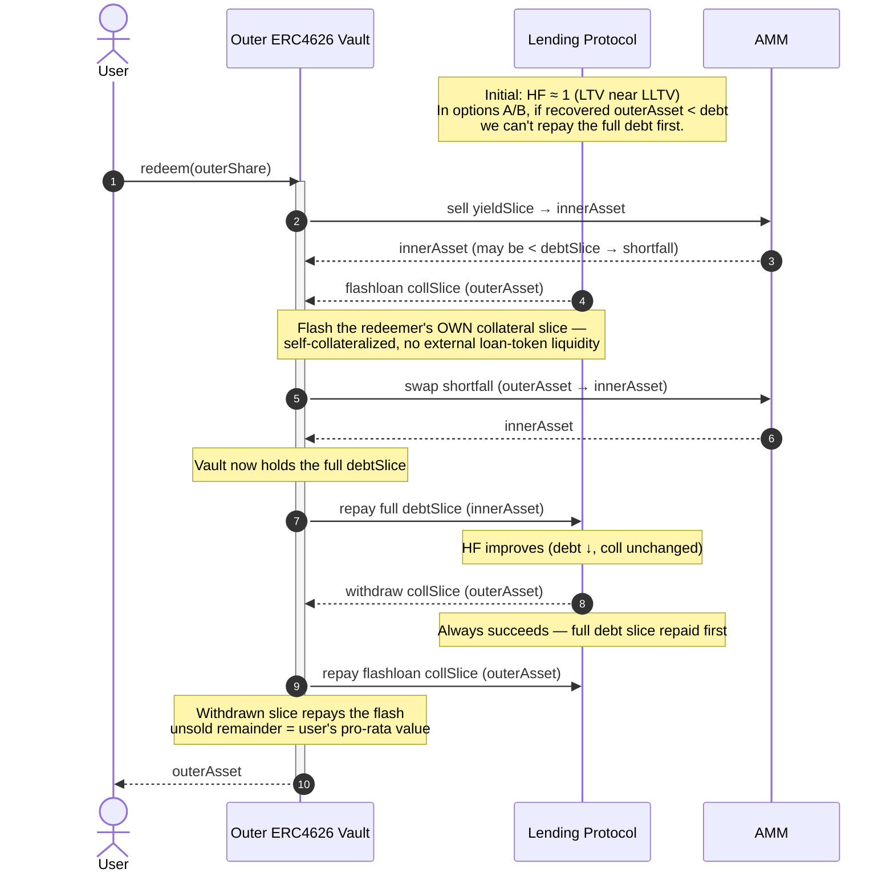
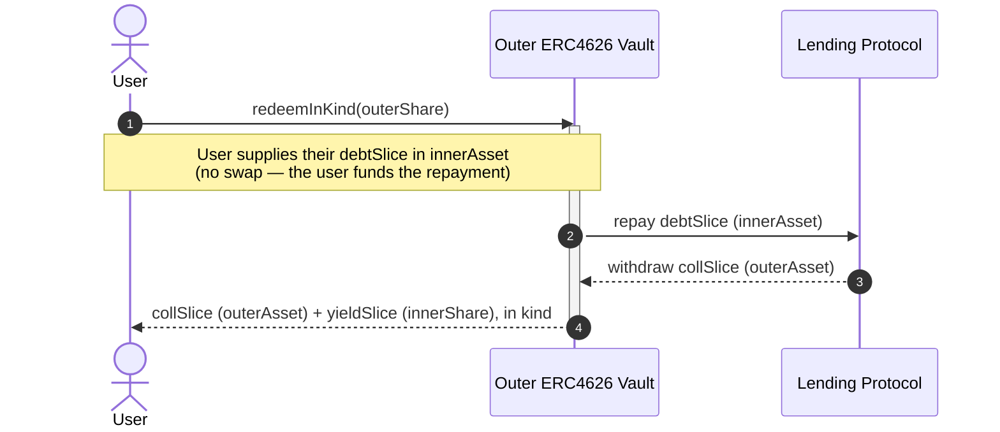

# FCM Architecture

This repo implements an [ERC4626](https://eips.ethereum.org/EIPS/eip-4626)-compliant vault which implements a levered investment with automated rebalancing.

## Terminology

- **Asset** - ERC4626 term meaning "the unit of account of this vault". Deposits, withdrawals, and NAV for a vault are denominated in the vault's asset. The asset must be an ERC20 token.
  - **InnerAsset/OuterAsset** - The asset of the inner vault or outer vault, respective (see below)
- **Share** - ERC4626 term meaning "a portion of the total assets in this vault". Shares are fungible and are represented as ERC20 tokens. Vault users deposit assets and receive shares.
  - **InnerShare/OuterShare** - The share of the inner vault or outer vault, respective (see below)
- **Outer Vault** - The ERC4626 vault implemented in this repository, which borrows against deposits to invest in an inner vault.
- **Inner Vault** - The ERC4626 vault which the outer vault invests borrowing proceeds in.

## Dependencies

### Lending Protocol

[Morpho Blue](https://github.com/morpho-org/morpho-blue)

### Automated Market Maker (AMM)

[FlowSwap (Uniswap v3)](https://flowswap.io/)

### Inner Vault

In general, the inner vault may be any ERC4626-compliant vault. As an example, Jon's FUSDEV vault uses [Morpho Vault v2](https://docs.morpho.org/build/earn/concepts/vault-mechanics)

**Liquidity:** We must assume that the inner vault MAY be unable to satisfy any withdrawal requests, at any time (eg. is illiquid). To address this in a general way, we primarily use DEX swaps to acquire/dispose of InnerShares. We then rely on the DEX to provide sufficient liquidity for the shares.

**NAV Reporting:** We must assume that the NAV (share price) reported by the vault may be out of date on the order of days.

## Deposit Flow

### A. AMM-Mediated Deposit

We swap debt tokens (InnerAsset) to InnerShares via an AMM. Our ability to satisfy deposits is dependent on available liquidity in the AMM pool.

### B. Direct Deposit

We deposit debt tokens (InnerAsset) to InnerShares via the inner vault's `deposit` function. Our ability to satisfy deposits is dependent on the vault's deposit capacity ([`maxDeposit`](https://ethereum.org/developers/docs/standards/tokens/erc-4626/#maxdeposit))

## Withdrawal Flow

There are several ways to implement withdrawals, enumerated below. The main differences are:

1. Source of liquidity risk (inner vault vs AMM).
2. Ability to withdraw full amount when LTV is near limit. In option C, the flashloan enables always repaying the full debt amount first. In options A/B, we may be unable to do this (depending on LTV). See [below](#ltv-limit-edge-case) for details.

### A. AMM-Mediated Withdrawal

#### Pros

- No inner vault liquidity risk

#### Cons

- Requires repaying debt before withdrawing collateral. Reverts if the yield→debt swap underdelivers and the intermediate HF would dip below 1.
- Pays DEX fees/slippage
- Pool liquidity risk: thin yield/debt pool degrades or blocks large redeems.

### B. Direct Withdrawal

#### Pros

- Redeems yield at NAV — no LP fee, no slippage on the yield leg.
- Independent on AMM liquidity for the yield asset.

#### Cons

- Dependent on available liquidity in inner vault.

### C. Flash Loan Path

#### Pros

- Deterministic unwind at any HF — debt is cleared before collateral moves.
- **Self-collateralized** — flashes the vault's _own_ collateral slice, so it needs no external loan-token liquidity. The vault is a net borrower of loan token (none sits idle in the Morpho singleton for it to draw on), so flashing loan token would depend on other suppliers' liquidity and fail at high utilization; flashing the collateral, already in the singleton, does not. **This self-sufficiency is the whole reason the flash path exists.**

#### Cons

- Most complex: callback-based reentry, encoded calldata, extra Morpho roundtrip.
- Larger attack surface — callback must validate msg.sender and decode data correctly.
- Still depends on DEX for the yield sale and reconcile legs (liquidity, fees/slippage)
- Draws the singleton twice per redemption, which bounds the size of a single call — see below.

#### Why flash at all, and what it costs

Options A and B have the same structural problem: the debt must be repaid before the collateral can be withdrawn, and the only money available to repay it is the yield leg. When the yield sale under-delivers — a thin pool, an adverse tick, a depegged inner share — the vault holds less than the debt slice, cannot repay it, and therefore cannot free the collateral. The redemption reverts, and it reverts hardest exactly when the position is nearest its LLTV, because that is when the collateral is worth least relative to the debt it carries. That is a bad failure mode for a withdrawal path: it strands holders precisely in the scenario they most want out of.

Flashing removes the ordering constraint. The vault borrows the redeemer's own collateral slice, sells just enough of it to cover the shortfall, repays the full debt slice, and only then withdraws. Because the repayment happens before the withdrawal, the withdrawal is health-factor-neutral and Morpho permits it at any HF. The unwind becomes deterministic instead of conditional on the yield leg's execution price.

The choice of *what* to flash matters as much as the decision to flash. Flashing loan token would be the obvious move — it is what the vault needs — but the vault is a net borrower of loan token, so none of its own sits in the singleton. It would be drawing on other suppliers' deposits, and would fail exactly when the market is fully utilized, which correlates with the stressed conditions that push a redemption into Case B. Flashing the collateral instead draws on the vault's own supplied position, which is always in the singleton by construction.

The cost of that choice is a **double draw**. Morpho's `flashLoan` transfers the assets out, invokes the callback, and only reclaims them via `transferFrom` after the callback returns. So during the callback the singleton is already down `collSlice`, and the callback's `withdrawCollateral(collSlice)` asks it for another. The pair needs `2 × collSlice` of the collateral token on hand at that instant.

Where the vault shares its market with other collateral suppliers, their deposits provide the headroom and this is invisible. In a dedicated market where the vault is the dominant or only supplier, the singleton holds roughly what the vault supplied, and the constraint binds at `collSlice ≤ 50%` of the position. Above that the withdrawal reverts on an insufficient balance.

This is a bound on call *size*, not on total withdrawable value. Each redemption removes collateral from the singleton and from the vault's position in equal measure, so the ratio is preserved and the next call is again capped at ~50% of what remains: a handful of successive calls drain all but a dust residue. `redeemInKind` avoids the flash entirely and has no such cap, at the cost of the caller sourcing the loan token themselves. Case A — the yield sale covers the debt slice — never flashes and is unaffected.

We accept the bound rather than restructure the callback. The alternative shapes (withdraw before flashing, or flash a smaller slice and loop) either reintroduce the ordering constraint the flash exists to remove, or add iteration to the one path that has to work under stress. A size cap that callers can trivially work around by splitting is the cheaper trade.

#### LTV Limit Edge Case

## Escape Hatch

A swap-free, in-kind exit, exposed as its own `redeemInKind` function distinct from the standard `redeem` above. The holder repays their pro-rata debt slice in `innerAsset`, their shares are burned, and they receive the pro-rata collateral (`outerAsset`) and yield (`innerShare`) in kind.

Because it delivers the yield leg in kind instead of selling it, it needs no swap — so it doesn't depend on the AMM or the inner vault to liquidate that leg (the two routes a normal `redeem` would use), and stays available when AMM liquidity is thin or manipulated. It still settles through Morpho, so the collateral withdrawal is subject to Morpho's collateral-price check; an underwater position can't be exited until liquidation restores it. One dependency it does retain: fees accrue on entry and mark NAV via the yield and market oracles — so `redeemInKind` is swap-free but not oracle-free. The caller must hold and approve the `innerAsset` debt slice (it is not sourced from the position), and the yield leg is returned in kind as `innerShare`, to be unwound separately.

## Rebalancing

See **TODO LINK TO REBALANCING SPEC**

### Idle InnerAsset After a Favorable Delever

The delever branch sizes its swap from the oracle: it sells `yieldToSell = repayAmount * 1e36 / yieldPrice` of `innerShare` to raise the `repayAmount` of `innerAsset` that lands the position back at `healthFactorMinTarget`. When the pool fills that sale at a materially better price than the oracle quoted, the swap returns more `innerAsset` than the sizing assumed. If the overshoot is large enough that the realized amount exceeds the vault's **entire** outstanding debt, `repayAll` clears the position by shares and the excess stays behind as idle `innerAsset`.

That residue is invisible to NAV. `totalAssets()` values exactly three things — collateral supplied to Morpho, the `innerShare` balance, and Morpho debt — and idle `innerAsset` is not among them. No later flow spends it either: `redeem` and `harvest` both measure `innerAsset` as a balance *delta*, so they neither credit nor consume a pre-existing balance, and `redeemInKind` distributes only collateral and yield. It is only reachable through emergency recovery, which sweeps it to the owner.

This is deliberate. All alternatives are worse:

- **Revert on the overshoot.** Delever is the safety-critical branch — it is what pulls an over-levered position back from liquidation. Failing it on a *favorable* fill would block de-risking exactly when the vault needs it. Health wins over accounting neatness.
- **Count idle balances in NAV.** Adding `innerAsset.balanceOf(vault)` to `totalAssets()` makes NAV donation-sensitive. NAV feeds share minting on deposit (measured as a NAV delta), fee accrual, and the performance high-water mark — so anyone could move all three by transferring tokens to the vault. That is a permanent widening of the attack surface traded against a residue that only appears on a rare favorable fill.
- **Swap the excess back to collateral.** Draws the same objection as reverting: it adds a second swap, a second price bound, and a second failure mode inside the one branch that must always complete.

The residue is bounded by the overshoot itself. In normal operation the delever targets `healthFactorMinTarget`, so `repayAmount` is a fraction of the debt and the realized amount has to beat the oracle by a wide margin to exceed 100% of it. The leak is real but small and infrequent, and it is accepted in exchange for a delever path that always completes.

## Custom Behaviour

See [here](https://github.com/OpenZeppelin/openzeppelin-contracts/blob/master/contracts/token/ERC20/extensions/ERC4626.sol#L50-L68) for guidance on how to safely extend the base ERC4626 contract.

## Security

### Deployment Trust Model & Constructor Validation

`FCMVaultFactory.createVault` is permissionless: anyone can deploy an `FCMVault` with any `InitParams`. **Deployment through the canonical factory is not an endorsement.** The factory fixes the bytecode and makes the address deterministic; it says nothing about whether the parameters describe a sane vault. A vault must be judged on its own configuration — tokens, Morpho market, pools, oracles, owner — exactly as any directly deployed contract would be.

The constructor validates what is cheap and locally decidable: the health-factor band ordering (`healthFactorMin <= healthFactorMinTarget <= healthFactorMaxTarget <= healthFactorMax`, with `healthFactorMin >= 1e18`), `yieldFactorMax >= 1e18`, and non-zero pool addresses. The `forceApprove` calls incidentally reject a zero or non-contract `collateralToken`, `loanToken`, `yieldToken`, `morpho`, or `swapRouter`.

It deliberately stops short of a full correctness check, because a constructor cannot perform one. Whether the yield oracle really prices `innerShare` in `innerAsset`, whether the configured pool is the pool the router will route through, whether the inner vault is solvent — these are properties of external contracts and of live state, not of the arguments. A partial on-chain check would mostly buy false confidence.

The bar we hold instead: **a misconfigured vault must be unusable, never quietly wrong.** A vault that reverts on every deposit is an acceptable outcome of a fat-fingered deployment; one that accepts deposits while silently mispricing them is not. Two structural properties do most of that work:

- **Morpho validates the market tuple for us.** The market id is `keccak256(loanToken, collateralToken, marketOracle, marketIrm, marketLltv)`, and every Morpho entry point requires `market[id].lastUpdate != 0`. Get any one of those five wrong and the derived id points at a market that was never created, so `supplyCollateral`, `borrow`, `repay`, and `withdrawCollateral` all revert. The vault is dead on arrival rather than quietly operating against the wrong market.
- **The swap price bound is oracle-derived, not pool-derived.** `SwapLib.swapLimit` builds `sqrtPriceLimitX96` from the oracle rate discounted by `maxSlippageBps`; the configured pool address is read only for the `slot0` spot check that decides whether to attempt the swap at all. The router resolves the pool it actually trades against from `(tokenIn, tokenOut, fee)` and the pool enforces the limit natively. So a mismatched `yieldLoanPool` / `collateralLoanPool` corrupts the go/skip decision — spurious skips leaving rebalance a no-op, or attempts the pool rejects with `SPL` — but it cannot make a swap execute outside the oracle-derived bound.

What is left unvalidated therefore lands in "unusable" rather than "exploitable": a wrong or zero `yieldOracle` reverts the first time `price()` is decoded, a wrong market tuple reverts on the first Morpho call, and a wrong pool degrades rebalancing instead of unbounding it. The residual risk sits with whoever chooses to deposit into a given vault — the same place it sits for any permissionlessly deployed contract.

### Donation/Inflation Attack

See [explanation from OpenZeppelin](https://docs.openzeppelin.com/contracts/5.x/erc4626#security-concern-inflation-attack).

Our implementation is safe from this attack because we inherit from the OpenZeppelin ERC4626 base contract, which implements a virtual share mitigation. See [here](https://github.com/OpenZeppelin/openzeppelin-contracts/blob/master/contracts/token/ERC20/extensions/ERC4626.sol#L22-L47) for guidance on extending this mitigation.

### Re-entrancy Attack (TODO)

For each external function, how does it protect against re-entrancy?

### Sandwich Attack

An attacker manipulates AMM prices before and after our swap to capture part of the value of our swap.

- The primary mitigation is a slippage limit, which limits how much slippage we will accept on each trade. This doesn't prevent the attack, but does limit how much value can be extracted per trade.
- `rebalance` enforces this limit using the pool's native `sqrtPriceLimitX96`: each rebalance swap carries a marginal-price bound derived from the yield oracle discounted by `maxSlippageBps`. The pool fills the swap only while its marginal price stays within the bound, then stops. A swap too large to reach the re-entry target within tolerance is a **partial fill** rather than a revert. Successive rebalances are expected to fill more as the gap (and price impact) shrinks, converging over several calls.
- The bound is on the pool's **marginal price** relative to the oracle, i.e. on price impact. The pool's fixed LP fee is a separate, known cost taken on the input and is not part of this bound.
- Flow as the underlying platform provides some protection. There is no system akin to [MEV-Boost](https://github.com/flashbots/mev-boost), which systematizes MEV extraction. No individual node in Flow can deterministically dictate transaction ordering. Attackers need to send many transactions, hope some are placed in the desired order, and be able to revert operations on those that are not in the desired order. Still possible, but more complex and expensive.

If an attacker is able to invoke a function which performs a swap (that isn't swapping their funds), then the sandwich attack becomes much more dangerous (eg. a permissionless `rebalance` or `harvest` function).

- The attacker can reliably order their operations by structuring the "full sandwich" as one transaction.
- The attack is repeatable.

### Oracle Manipulation (TODO)

## Dust Strategy (TODO)

## References / Prior Art

- [Patrick's Vault PoC](https://github.com/holyfuchs/fcm-sol-poc)
- [Schlagonia Morpho Lender Vault](https://github.com/Schlagonia/lender-borrower/blob/morpho/src/MorphoBlueLenderBorrower.sol)
