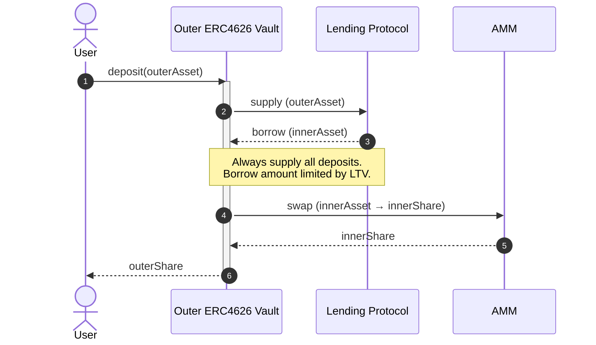
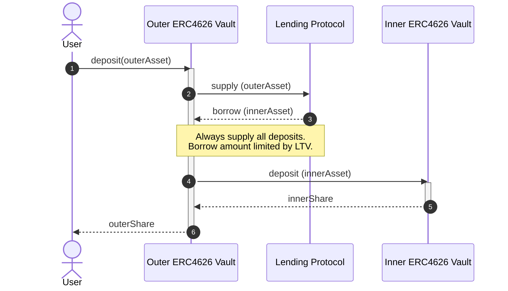
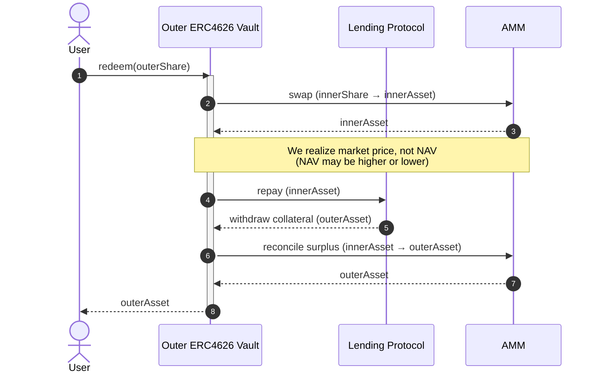
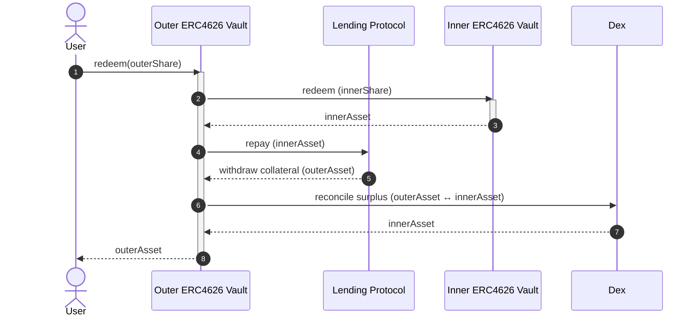
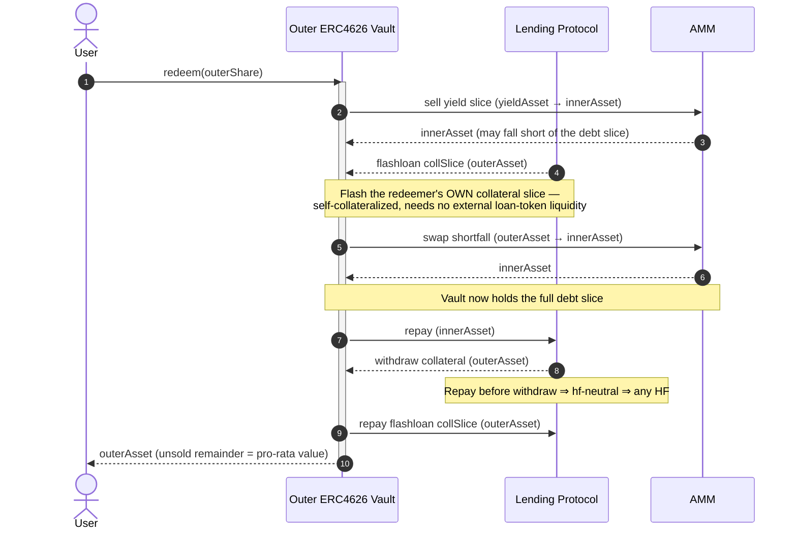
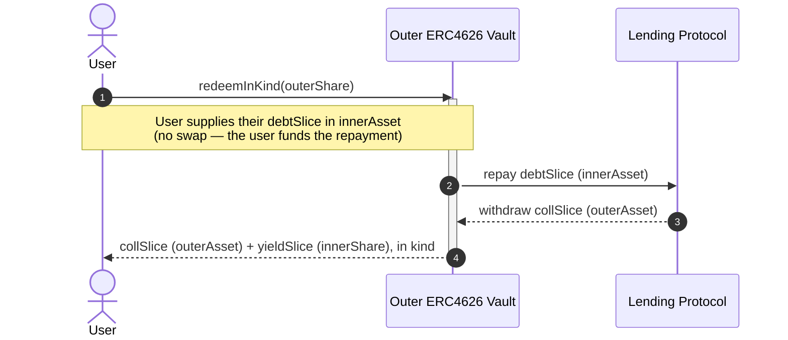

# FCM Architecture

This repo implements an [ERC4626](https://eips.ethereum.org/EIPS/eip-4626)-compliant vault which implements a levered investment with automated rebalancing.

## Terminology

- **Asset** - ERC4626 term meaning "the unit of account of this vault". Deposits, withdrawals, and NAV for a vault are denominated in the vault's asset. The asset must be an ERC20 token.
  - **InnerAsset/OuterAsset** - The asset of the inner vault or outer vault, respective (see below)
- **Share** - ERC4626 term meaning "a portion of the total assets in this vault". Shares are fungible and are represented as ERC20 tokens. Vault users deposit assets and receive shares.
  - **InnerShare/OuterShare** - The share of the inner vault or outer vault, respective (see below)
- **Outer Vault** - The ERC4626 vault implemented in this repository, which borrows against deposits to invest in an inner vault.
- **Inner Vault** - The ERC4626 vault which the outer vault invests borrowing proceeds in.

## Dependencies

### Lending Protocol

[Morpho Blue](https://github.com/morpho-org/morpho-blue)

### Automated Market Maker (AMM)

[FlowSwap (Uniswap v3)](https://flowswap.io/)

### Inner Vault

In general, the inner vault may be any ERC4626-compliant vault. As an example, Jon's FUSDEV vault uses [Morpho Vault v2](https://docs.morpho.org/build/earn/concepts/vault-mechanics)

**Liquidity:** We must assume that the inner vault MAY be unable to satisfy any withdrawal requests, at any time (eg. is illiquid). To address this in a general way, we primarily use DEX swaps to acquire/dispose of InnerShares. We then rely on the DEX to provide sufficient liquidity for the shares.

**NAV Reporting:** We must assume that the NAV (share price) reported by the vault may be out of date on the order of days.

## Deposit Flow

### A. AMM-Mediated Deposit

We swap debt tokens (InnerAsset) to InnerShares via an AMM. Our ability to satisfy deposits is dependent on available liquidity in the AMM pool.



### B. Direct Deposit

We deposit debt tokens (InnerAsset) to InnerShares via the inner vault's `deposit` function. Our ability to satisfy deposits is dependent on the vault's deposit capacity ([`maxDeposit`](https://ethereum.org/developers/docs/standards/tokens/erc-4626/#maxdeposit))



## Withdrawal Flow

There are several ways to implement withdrawals, enumerated below. The main differences are:

1. Source of liquidity risk (inner vault vs AMM).
2. Ability to withdraw full amount when LTV is near limit. In option C, the flashloan enables always repaying the full debt amount first. In options A/B, we may be unable to do this (depending on LTV). See [below](#ltv-limit-edge-case) for details.

### A. AMM-Mediated Withdrawal



#### Pros

- No inner vault liquidity risk

#### Cons

- Requires repaying debt before withdrawing collateral. Reverts if the yield→debt swap underdelivers and the intermediate HF would dip below 1.
- Pays DEX fees/slippage
- Pool liquidity risk: thin yield/debt pool degrades or blocks large redeems.

### B. Direct Withdrawal



#### Pros

- Redeems yield at NAV — no LP fee, no slippage on the yield leg.
- Independent on AMM liquidity for the yield asset.

#### Cons

- Dependent on available liquidity in inner vault.

### C. Flash Loan Path



#### Pros

- Deterministic unwind at any HF — debt is cleared before collateral moves.
- **Self-collateralized** — flashes the vault's _own_ collateral slice, so it needs no external loan-token liquidity. The vault is a net borrower of loan token (none sits idle in the Morpho singleton for it to draw on), so flashing loan token would depend on other suppliers' liquidity and fail at high utilization; flashing the collateral, already in the singleton, cannot. **This self-sufficiency is the whole reason the flash path exists.**

#### Cons

- Most complex: callback-based reentry, encoded calldata, extra Morpho roundtrip.
- Larger attack surface — callback must validate msg.sender and decode data correctly.
- Still depends on DEX for the yield sale and reconcile legs (liquidity, fees/slippage)

#### LTV Limit Edge Case

```mermaid
sequenceDiagram
      autonumber
      actor User
      participant Outer as Outer ERC4626 Vault
      participant Lender as Lending Protocol
      participant Dex as AMM

      Note over Lender: Initial: HF ≈ 1 (LTV near LLTV)<br/>In options A/B, if recovered outerAsset < debt<br/>we can't repay the full debt first.

      User->>Outer: redeem(outerShare)
      activate Outer

      Outer->>Dex: sell yieldSlice → innerAsset
      Dex-->>Outer: innerAsset (may be < debtSlice → shortfall)

      Lender-->>Outer: flashloan collSlice (outerAsset)
      Note over Outer,Lender: Flash the redeemer's OWN collateral slice —<br/>self-collateralized, no external loan-token liquidity

      Outer->>Dex: swap shortfall (outerAsset → innerAsset)
      Dex-->>Outer: innerAsset
      Note over Outer: Vault now holds the full debtSlice

      Outer->>Lender: repay full debtSlice (innerAsset)
      Note over Lender: HF improves (debt ↓, coll unchanged)

      Lender-->>Outer: withdraw collSlice (outerAsset)
      Note over Lender: Always succeeds — full debt slice repaid first

      Outer->>Lender: repay flashloan collSlice (outerAsset)
      Note over Outer: Withdrawn slice repays the flash;<br/>unsold remainder = user's pro-rata value

      Outer-->>User: outerAsset
      deactivate Outer
```

## Escape Hatch

A swap-free, in-kind exit, exposed as its own `redeemInKind` function distinct from the standard `redeem` above. The holder repays their pro-rata debt slice in `innerAsset`, their shares are burned, and they receive the pro-rata collateral (`outerAsset`) and yield (`innerShare`) in kind.



Because it delivers the yield leg in kind instead of selling it, it needs no swap — so it doesn't depend on the AMM or the inner vault to liquidate that leg (the two routes a normal `redeem` would use), and stays available when AMM liquidity is thin or manipulated. It still settles through Morpho, so the collateral withdrawal is subject to Morpho's collateral-price check; an underwater position can't be exited until liquidation restores it. One dependency it does retain: fees accrue on entry and mark NAV via the yield and market oracles — so `redeemInKind` is swap-free but not oracle-free. The caller must hold and approve the `innerAsset` debt slice (it is not sourced from the position), and the yield leg is returned in kind as `innerShare`, to be unwound separately.

## Rebalancing

See **TODO LINK TO REBALANCING SPEC**

## Custom Behaviour

See [here](https://github.com/OpenZeppelin/openzeppelin-contracts/blob/master/contracts/token/ERC20/extensions/ERC4626.sol#L50-L68) for guidance on how to safely extend the base ERC4626 contract.

## Security

### Donation/Inflation Attack

See [explanation from OpenZeppelin](https://docs.openzeppelin.com/contracts/5.x/erc4626#security-concern-inflation-attack).

Our implementation is safe from this attack because we inherit from the OpenZeppelin ERC4626 base contract, which implements a virtual share mitigation. See [here](https://github.com/OpenZeppelin/openzeppelin-contracts/blob/master/contracts/token/ERC20/extensions/ERC4626.sol#L22-L47) for guidance on extending this mitigation.

### Re-entrancy Attack (TODO)

For each external function, how does it protect against re-entrancy?

### Sandwich Attack

An attacker manipulates AMM prices before and after our swap to capture part of the value of our swap.

- The primary mitigation is a slippage limit, which limits how much slippage we will accept on each trade. This doesn't prevent the attack, but does limit how much value can be extracted per trade.
- `rebalance` enforces this limit using the pool's native `sqrtPriceLimitX96`: each rebalance swap carries a marginal-price bound derived from the yield oracle discounted by `maxSlippageBps`. The pool fills the swap only while its marginal price stays within the bound, then stops. A swap too large to reach the re-entry target within tolerance is a **partial fill** rather than a revert. Successive rebalances are expected to fill more as the gap (and price impact) shrinks, converging over several calls.
- The bound is on the pool's **marginal price** relative to the oracle, i.e. on price impact. The pool's fixed LP fee is a separate, known cost taken on the input and is not part of this bound.
- Flow as the underlying platform provides some protection. There is no system akin to [MEV-Boost](https://github.com/flashbots/mev-boost), which systematizes MEV extraction. No individual node in Flow can deterministically dictate transaction ordering. Attackers need to send many transactions, hope some are placed in the desired order, and be able to revert operations on those that are not in the desired order. Still possible, but more complex and expensive.

If an attacker is able to invoke a function which performs a swap (that isn't swapping their funds), then the sandwich attack becomes much more dangerous (eg. a permissionless `rebalance` or `harvest` function).

- The attacker can reliably order their operations by structuring the "full sandwich" as one transaction.
- The attack is repeatable.

### Oracle Manipulation (TODO)

## Dust Strategy (TODO)

## References / Prior Art

- [Patrick's Vault PoC](https://github.com/holyfuchs/fcm-sol-poc)
- [Schlagonia Morpho Lender Vault](https://github.com/Schlagonia/lender-borrower/blob/morpho/src/MorphoBlueLenderBorrower.sol)
