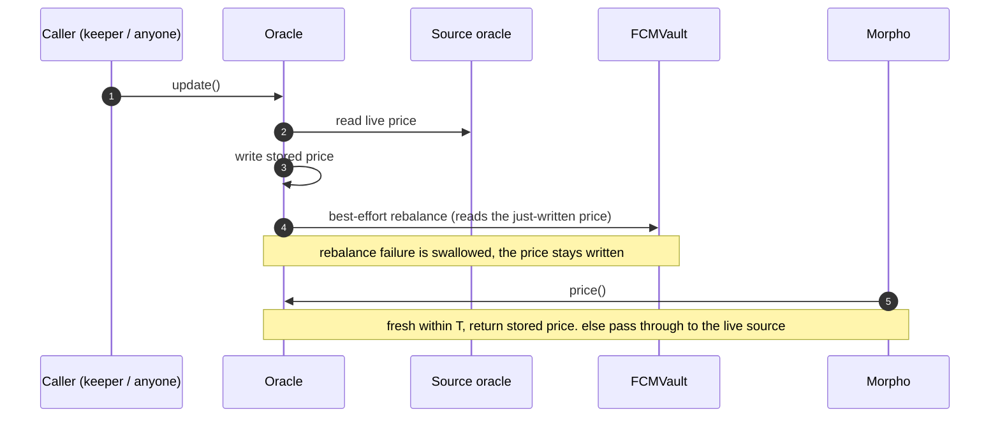

# Rebalancing Oracle

**Status:** Draft
**Owner:** @Jordan Ribbink

A Morpho market oracle ([#75](https://github.com/onflow/flow-credit-markets/issues/75)) whose price can only be advanced through a path that also attempts the vault's `rebalance()`, so the position de-risks in step with price moves. Backed by an underlying source price oracle (Pyth). Makes liquidation rarer; it is not a liquidation-prevention guarantee.

## Interface

Implements Morpho `IOracle` — `price() → uint256` (1e36-scaled).

- **`price()`** — if the stored price was written within `T`, return it; otherwise return the live source price (pass-through).
- **`update()`** (permissionless) — read the live source price → write the stored price → attempt `rebalance()` (best-effort), which reads the just-written price. The price is written whether or not the rebalance succeeds. (Writing before the rebalance means the existing `rebalance()` needs no change — it reads the oracle as it always has; see *Assumptions*.)

## Properties

1. **`update()` is the sole writer of the stored price.** Any advance of the market's price is therefore accompanied by a rebalance attempt in the same call — including when a liquidator triggers an update to fetch a fresh mark. The *attempt* is guaranteed; its success is not (best-effort).
2. **Advances regardless of rebalance outcome.** A failed rebalance never reverts the price write or panics the calling tx.
3. **Bounded staleness.** The market never reads a stored price older than `T`; past `T`, `price()` falls through to the live source price.
4. **Permissionless.** Anyone can call `update()`; the price cannot be withheld.

## Integration

- The Morpho market's oracle is set to this contract.
- The existing per-vault [Vault Rebalancer](./vault-rebalancer.md) (Cadence scheduled tx) is the default caller of `update()` — the price write replaces its bare `rebalance()` call. Panic-safety is Cadence-side (`coa.call`), so a failed rebalance does not abort the scheduled tx.
- `rebalance()` remains permissionless, idempotent, self-guarding, slippage-bounded; keep `maxSlippageBps` **below the Morpho liquidation penalty**.

## Assumptions

- **Swap-path assets are callback-free** (no transfer hooks / ERC777-style callbacks). `update()` writes the price before the rebalance runs, so during the rebalance the vault is briefly marked at the new price while still unhealed; a callback token in the swap path could reentrantly liquidate it in that window. This is the **same assumption the vault already relies on everywhere** — it has no reentrancy guards despite external swaps and balance-delta accounting across redeem/rebalance/harvest. Writing before the rebalance is deliberate: it lets the existing `rebalance()` stay unchanged (it reads the freshly-written oracle as always) rather than re-plumbing it to source a fresh price. Verify the assumption when onboarding any new asset.

## Parameters / open

- **`T`** — freshness threshold; short (heartbeat-scale). Sized so stored-price staleness ≈ a normal feed.
- **Trigger cadence** — deviation and/or time (debt accrues interest, so a periodic tick is needed even at a flat price).
- **HF buffer** — the vault's primary safety margin; sized to realistic gap moves of the collateral.
- **Backstop** — Morpho liquidation, optionally Pre-Liquidations for gentler/earlier de-risking.
